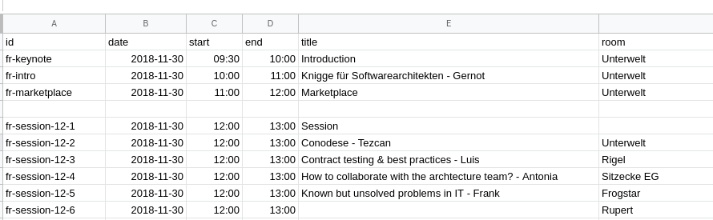

# SwaCamp Tools

## Load Schedule From Google Drive

**Intention**

When the marketplace happens, the schedule should be updated live, so that participants can already see 
the schedule on their phones.

To make entering the schedule easy, it can be entered via a Google Drive spreadsheet, which is then pulled by a
script, converted to JSON and made available on a webserver. This file can then be referenced on
the swacamp website.

**Schedule Spreadsheet**

The schedule should look like:

|  Column   |  Idea |
|---        |---|
| id        | Unique id of an entry (really must be unique!)  |
| date      | Date in format yyyy-MM-dd  |
| start     | Start time in format HH:mm  |
| end       | End time in format HH:mm  |
| title     | Session title (free text) |
| room      | Session room (free text) |

**Update script**

The schedule can be converted to JSON by using `update_schedule_from_google_drive`.
Please make sure to have python3 installed.

`python update_schedule_from_google_drive $OUTPUT_JSON $GOOGLE_DRIVE_URL`

|  Parameter        |  Idea |
|---                |---|
| OUTPUT_JSON       | Location to write the file to, local path, must be then served by a webserver |
| GOOGLE_DRIVE_URL  | Publicly accessible link to the google drive spreadsheet csv export  |

The generated JSON can then be referenced in the Konopas index.html.

## Generating Slack Notifications when a Session starts

**Intention**

Whenever a session starts, conference participants should get a Slack notification.

**Notification script**

`python swacamp_slack_notify.py $SCHEDULE_FILE $SLACK_HOOK_URL` 

|  Parameter        |  Idea |
|---                |---|
| SCHEDULE_FILE     | Path to the locale schedule json file |
| SLACK_HOOK_URL    | Slack hook url |
